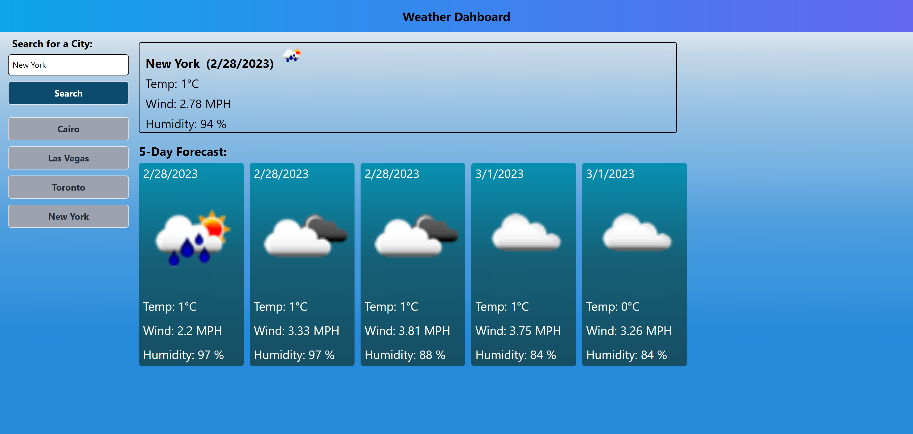

# Weather-Forecast-Application

## Description
The weather forecast application priveds user with current and next 5 days weather forecast and includes temperature, wind and humidity for any searched  city. City search will be saved for qiuck reference in the future.

## Table of Contents

- [Technologies and WireFrame](#technologiesandwireframe)
- [API](#api)
- [Screen Shot](#screenshot)
- [Installation](#installation)
- [Usage](#usage)
- [Credits](#credits)
- [License](#license)

## Technologies and WireFrame

- HTML
- CSS
- Javascript
- [Tailwindcss](https://tailwindcss.com/)

## API

- Weather data is provided by [OpenWeather API](https://openweathermap.org/api)

## Screen Shot

## Installation

  Please visit [Weather Forecast Website](https://terrykor.github.io/Weather-Forecast-Application/)

## Usage

 - Enter any city name in the search field;
 - Then click search button;
 - Once button is clicked you see current weather foracast and 5 days weather forecast;
 - All cities searched will be saved;

## Credits

- [Terry](https://github.com/TerryKor)

## License

